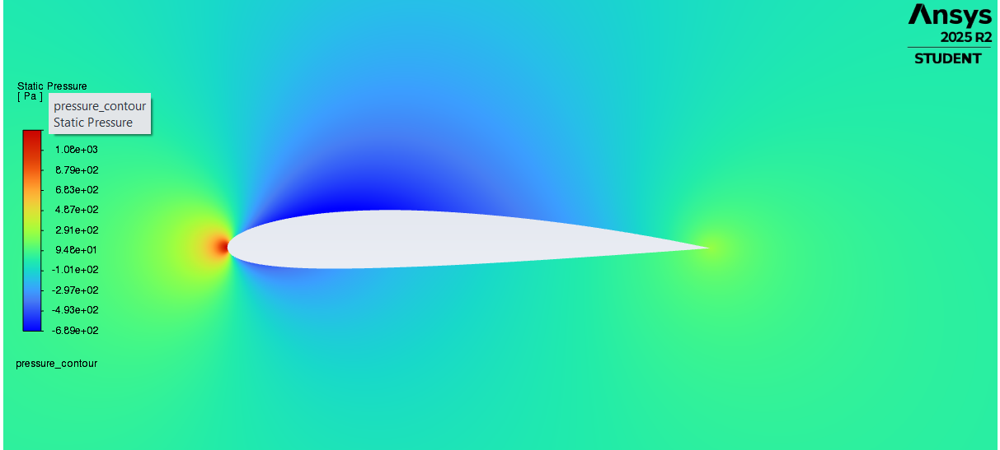
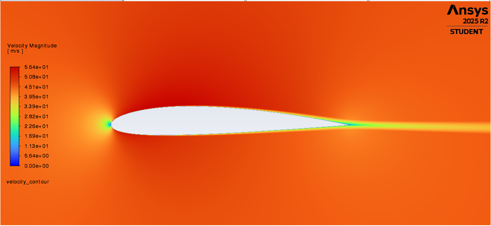
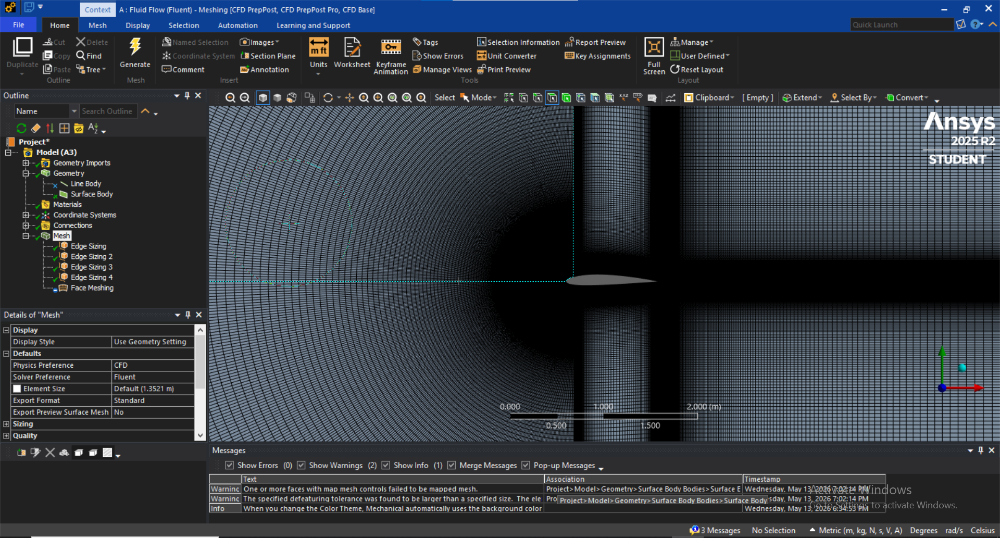

# Airfoil Aerodynamic Analysis Project

## Overview
This project presents a computational analysis of an airfoil to study its aerodynamic behavior under different flow conditions. The main objective is to evaluate pressure distribution, velocity field, and overall aerodynamic performance.

## Tools Used
- ANSYS Fluent / ANSYS Workbench
- CAD tools for geometry

## Methodology
- Geometry creation of the airfoil
- Mesh generation
- Setting boundary conditions
- Running CFD simulation
- Post-processing results

## Visual Results

### Pressure Contour

### Velocity Contour

### Mesh

## Key Learnings
- Understanding aerodynamic behavior
- Mesh sensitivity effects
- CFD workflow basics
- Interpretation of simulation results

## Author
Mechanical Engineering Student
Interested in Fluid Mechanics and Aerospace Applications
